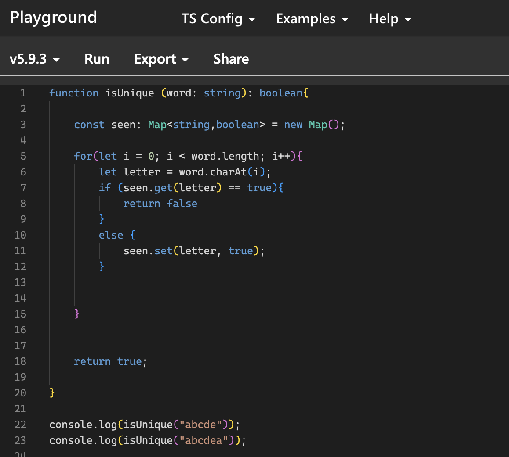

## Introduction

AI is used in many aspects of life. AI can be used for finding recipies, studying for different classes, support in theoretical thinking, and straight up cheating in homework. With the growth of AI, students become less ambitious when it comes to learning, and the same can be said for many types of students, including those in Software Engineering. There are many types of AI: ChatGPT, Claude, Grok, Gemini, DeepSeek, and more on the way! For a Software Engineer, AI can be used for making test cases, generating sample solutions, support in theoretical thinking, fixing ESLint errors, and more. Personally, I have used AI for generating test cases and finding edge cases in my code, and it has worked suprisingly consistently. 

## My use of AI
Within the scope of my Software Engineering class, I have had many experiences with AI technology in ICS 314:
- Experience WODS:
Personally, for the different experience WOD's like E18, where it was an introduction to functional programming, I strived to not use AI because I wanted the most out of the experience for the future. In this WOD, I tried to use different functions like find and reduce to pass data of different objects and print out certain things.

- In class Practice WODS:
For me, I have used AI for different things in my In-class practice WOD's. I used AI to give me instant feedback on code suggestions and to give me different test cases for my working code. One example is the History of Surfing where I needed instant feedback on using a container for my images and text. Using AI, helped to make my code writing much more efficent.

- In class WOD's:
Just like other WOD's, I definitely have used AI for my In Class WOD's for the various test case generation, instant feedback, fixing ESLint errors, and questions on how to implement different things. For example, a in class WOD was Maui Brewing where we had to implement an identical website using React or Next-JS under a certain amount of time. Even though it would be a better benefit for me to do it own my own strength, combining my existing skills with AI to generate a starting solution is definitely more efficent especially with my grade on the line every week.

- Essays:
I do not use AI for essays because I prefer to write based on my own thoughts and feelings. Even though it may be more efficent and easier to ask AI for ideas and starting solutions, I prefer to research on my own with Google and to structure my thoughts with a little time and effort. 

- Final Project:
For my Software Engineering 1 Final Project, my team made an event hub website, and my task was to create a "create event" form that writes to the database. Because of various issues, I had difficulties and so I used AI, specifically ChatGPT to help with a solution to work around the errors that Vercel was giving to my page. Overall, AI had helped me with giving different database commands, and rewiring my code to complete the task.

- Learning a concept/material:
During the class, we had a new concept of databases and using websites with Prisma. For me, I used AI (specifically ChatGPT) to give a detailed explanation, clarity, and how to install Prisma/work Prisma because the original instructions that the professors gave with Prisma wasn't viable and was severely outdated. Using AI in this case was definitely very useful especially in WOD's since the material/information is severely needed during tests that are low in time.

- Answering a question in class/discord:
For me I have had many personal questions answered from AI. Like for example, when working with Prisma databases in our recent WOD's like Digits, a question that I had was about the command to seed the database. An AI, ChatGPT was able to give me an instant and reliable answer in seconds.

- Asking/Answering a smart question on discord:
I have never used AI with smart questions, whether asking or answering because I personally haven't asked or answered a smart question on the ICS 314 Discord. In the future, I am more inclined in using the smart questions discord tab in the future.

- Coding Example:
A Coding Example would be another at home WOD, unfortunately I can't remember the specific name but it was the practice with functional programming. For me I have used AI with giving example of how different functions can be written like the function for each loop. Using ChatGPT/Gemini, I was able to create example for each loops and was able to complete my WOD, with my new added knowledge from AI. 

- Explaining Code:
During my Final Project, when I had errors on Vercel with the whole website having errors in the code, I used an AI, ChatGPT to explain the code, specifically the error in the code. Even though, the system, VSCode was showing the errors, I needed more help to debug it.

- Writing Code:
On the topic of the Final Project, an AI, specifically Co-Pilot was very useful when creating seedings for the events. When I had the task of making 50 "real world" data for the project, I used Co-Pilot to create realistic seedings for the project like "School Volleyball tournament" or "Python Workshop" for our website. Even though I could do it manually, I used AI to make the code more efficently 

- Documenting Code:
When it comes to documenting code, I have not used AI because I don't like the results that AI gives and prefer to do it on my own.

- Quality assurance:
I have used AI for Quality assurance, specifically in the beginning WOD's, like E12, when making a Jamba Juice Menu, I have used ChatGPT, to ensure that my code is made with quality, and has quality test cases.

- Other Uses:
Another use was when having to do different readings like having to start up Prisma and different technologies, I have used AI, ChatGPT to give summaries of the reading to make it easier to read.

## Impact on Learning and Understanding
AI has impacted my learning and understanding in many ways. I enjoy how in this software engineering class, instead of banning the use of the technology, it's used as a tool to strengthen our learning. And as a student that's how I see AI, a tool to be used, not smarter than us but a database with the capacity to grow. AI has helped me learn valuable concepts of software engineering like code formating, design patterns, testing edge cases and more. 

## Practical Applications
Personally, outside of the classroom experience, I have used AI for basic recipie finding/generation for cooking and studying for final/midterm test in other classes. AI's vast knowledge and database is a strong tool that can be used for many people outside of coding and software engineering.

## Challenges & Opportunities 
A big challenge that I see that AI has is it's explanations in difficult topics. Reguarding AI, specifically ChatGPT the most, it can be very limiting in it's explanations to break things down. The explanations can definitely have a little bit of work, as well as the fact that these explanations can behind a paywall. With AI, things can usually get down to how we prompt/use the technology compared the to the actual technology itself. 

## Comparative Analysis
An important aspect that I see to learning with AI and without AI is the difference between memory retention. In usual classes, it's always memorization and with the little time that college semesters have it's always down to how much can we remember on tests. But in this ICS 314 Class, we can have AI on tests, which can be a greater level of advancement of education or the limiting factor that keeps students reliant on technology.

## Future Considerations
Future considerations in mind, I believe that AI has much more room to grow. Many potential advancements, challenges, and areas to improve for AI and can be even better in software engineering than seasoned software developers. For me, I don't have any fear about it because as much as it grows, just like humans it won't be perfect or any smarter than the people that make it. 

## Conclusion
In conclusion, AI is a powerful tool for many student, software engineers, professors, and many people across the world. In future courses, I would recommend that other software engineering courses could also be this open with use of AI just like this one. Some improvements in the course directions would also be useful to limit the overuse of AI, but in general, AI is a strong tool. No matter how big AI grows, humans will also grow too.

