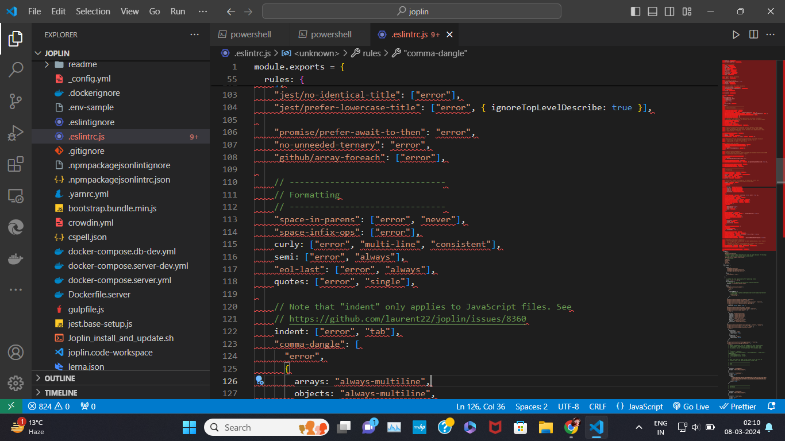

Many people see coding standards as a headache and a pain to deal with. And I am one of them. Coding standards are definitely a useful tool that every software engineer needs to master. Coding standards are used so that no matter whether it's an experienced veteran or a first time beginner, that when they see code, it's consistent and readable. Despite that, there are many pros and cons with coding standards.

## Glows

Others may say that coding standards help to produce quality code and help people learn a programming language and they're right. Coding Standards can be a major help with debugging. When seeing code isn't running on the live preview or when compiling, it's helpful to see where specifically the code went wrong, especially if there are colored indicators to show you. In comparison, when I used UNIX, if code had a few errors, it would still run but it was up to us as the programmers to search files and files to see the exact line where it went wrong. Coding standards are a great tool for quality, debugging, and overall having consistent code.

## Grows

After a week of using ESLint in VSCode, I can definitely say that I need more time to grow with coding standards. On the other hand with colored indicators, it can be very frustating to see an entire screen full of red colored indicators because of code errors. I can see that with the slightest space or indent, ESLint span the entire screen with these infamous red indicators. With the most recent Workout of the Day (WOD) in my Software Engineering class, because these WOD's are timed, I had the feeling of pressure when racing against the clock to work against these ESLint Errors. Coding errors are very useful but they can be very tedious and time consuming.

## Conclusion

Coding standards are there to raise the level of software engineers. Many people glow with them and many are still growing, but coding standards are here to stay. A wise person once said, "Practice doesn't make perfection, but makes improvement. No one is perfect". 

