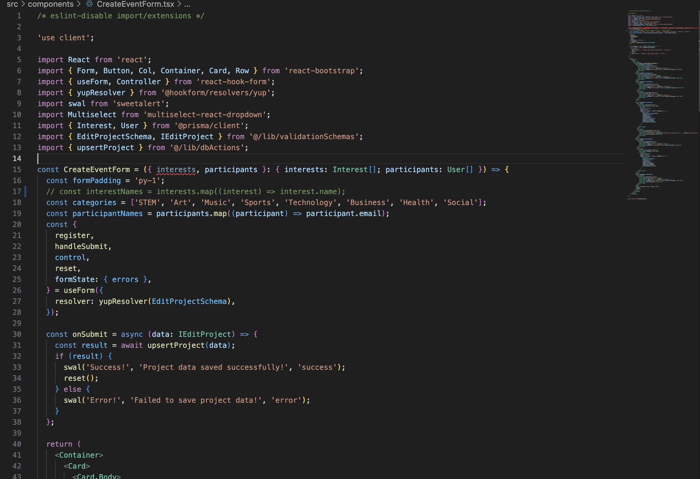
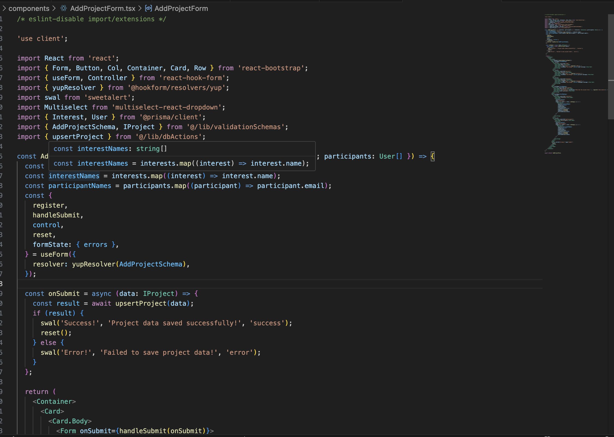
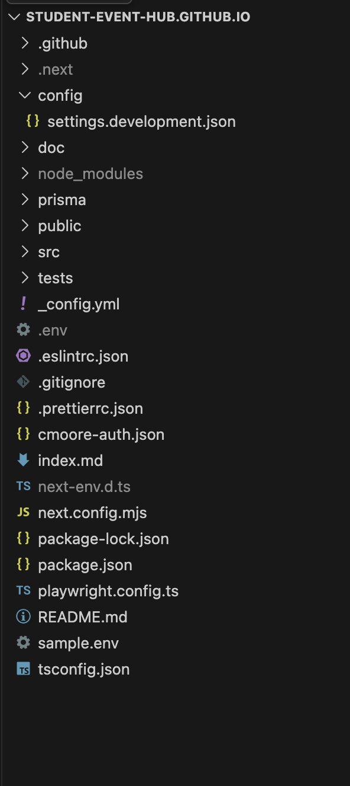

## The Ingenuity of Code Design Patterns

Coding Design Patterns are different ways that people like to organize how they contain or write their code. Many people can group their code up or write their code with certain objects being created in mind, or choosing to organize their classes, objects, components a certain way. Design Patterns are used within many software engineers to be used as a blueprint when writing code and as a guideline to make our projects more organized and easier to look at. Many websites show how design patterns help with object creation, organization, and interaction. 

## Conclusion

Overall, Design Patterns matter because it helps code to be more readable, reusuable, and manageable. With a layout on where code goes, many other software engineers can read our code more clearly and see where different components, styles, and programs are. With code being easier to read, it also becomes easier to manage and add onto more things. Maybe another developer wanted to add another button onto the navbar, it would be easier to do when code is written with Design Patterns where fellow team members can work on different tasks without being confused. Also with similar code having Design Patterns, it can also be reused in different parts of the algorithm.

Personally, when working on my different projects in Github, some of the design patterns that I have used within my code would definitely be more towards the Behavioral/Interaction Patterns. For me, when using some of the next.js and React templates, I prefer having different parts of a website in different folders like how Navbar is in one folder, Prisma Seeding is in a different folder, and the multitudes of components is in another folder. Like for example, if i needed to add another webpage, I know that with my design pattern, I can reuse another existing webpage and make a new folder because of the organization and interaction patterns of the Coding Design Pattern that I use. In conclusion, Design Patterns are a strong tool that many software developers can use when making and organizing their code.

