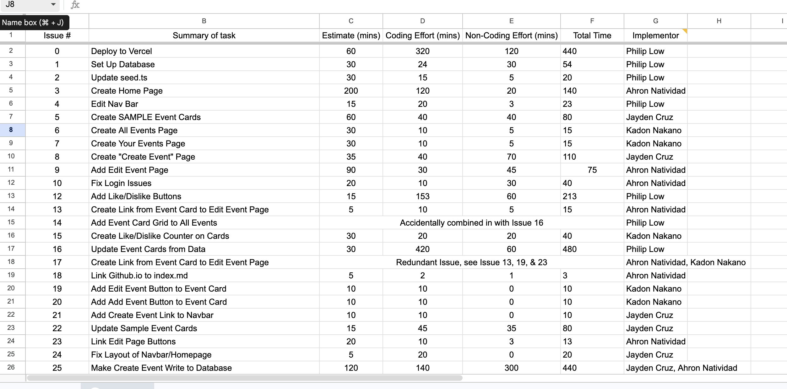

## Student Event Hub Effort Estimates

For me, I made my effort estimates based on the difficulty/scope of the issue and from previous experience. For example, for issue 22, where I just had to update a couple of values on the sample event cards and make minor tweaks, I put the estimate for 15 minutes. Compared to other issues where the scope is much larger like making the create event form write to the data base, I put a much larger estimate of 60-120 mins.

Yes, the estimates were wrong and off most of the time, but whether it was an issue that I made or someone else made, seeing the estimates were a little useful combined with the TODO list on the task helped to gauge how much time I should be spending on each task. For example, if i estimated a large amount of time on one task, it's definitely not wise to take multiple other issues at the same time.

I think tracking effort was useful. For our project team, we weren't as diligent to track non-coding time, but when we met outside of class to discuss issues, it helped to discuss how much time we were spending and what issues came along, and as a group we could tackle specific issues as a team or even other team members helping to support in different tasks. 

For actual effort, just like practice WOD's, I used a timer and memory in when I start and finish tasks. I would say my methods are somewhat useful and efficent because even if my times weren't ultimately perfect and precise, my effort times definitely reflected how much effort and thinking went into each task. Some tasks were definitely more focused on than others and it showed through the effort times.

In the future, I would change/improve my effort times/estimation through having a log to track non-coding time. Even though I tracked how much time I spent actually coding, I never thought about tracking non-coding time, and the times on the spreadsheet were just informed guesses. I would also have the person making the issue create the estimate compared to the person actually taking the issue because sometimes they are different people altogether. For me, I made alot of the tasks between my team, and had a good estimate of time taken for each task but didn't commmunicate or log it down. In conclusion, these effort estimates/log are a great way to log progress and to truly prepare ourselves and our team to conquer something as small as a small webpage, to a fully working behemoth of a website.

