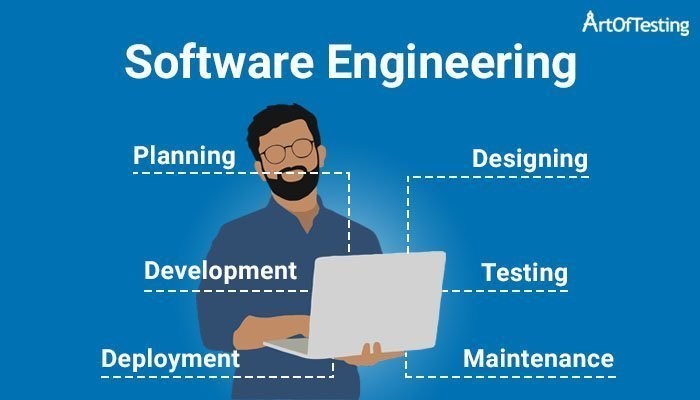

## What is Software Engineering?

Software engineering is not just writing code. Software engineering not just web development. Software engineering isn't just about using Github either. Software Engineering is the continual process of building, developing, fixing, editing, and testing software applications. As I continue to make progressive steps in my software engineering career, I realize how many crucial skills and concepts a software engineer must master to truly master to grow in their career. Many skills from how to manage a project with different teamates, to the responsibility to make sure the software that we develop is safe and secure to many user, to the small habits that we make with our code to make it readable and organized. Software Engineering isn't just an easy task to do but a continual process of improvement. 

## Agile Project Management
Outside of software engineering, many group projects need constant collaboration, feedback, compromises, communication, and changes to get to the end goal of having the finished project. The same can be said in software engineering. Agile Project Management is the approach manage and develop different projects. For me, in my final project of my software engineering 1 class, we had a final project of creating a website for many different students to use, and we managed it through a specific case of project management called issue project management. Our group had different meetings throughout the month to achieve different milestones in our project whether that's to focus on specfic looks of the website or how it interacts. Using issue project management, we made different tasks or 'issues' that each of us could do to progress our project. Outside of that class, I can definitely see myself using agile project management to manage our project organization even outside of web development. 

## Design Patterns
Design patterns are different ways that a software engineer can structure code or organize interactions between different project components. Design patterns are useful because it helps different users to read code more efficently and helps the developer to be able to copy and reuse different parts of the code to other different parts of the project. Software Engineers always want to be efficent with their time, why make struggle to make something when something similar can be helped to guide you? During my software engineering class, we used different templates for different languages like React and Next.js. We structured our code based on interactions like for example, different components in one folder, essays in another, and different issues in another repository. Outside of that class, I see myself using different design patterns in various personal projects and group projects.

## Conclusion
Overall, software engineering isn't just the applications but the skills that every software engineer needs to master. These different skills are the foundation, the start for every software engineer needs to truly grow and flourish in any environment, company, and start-up.

