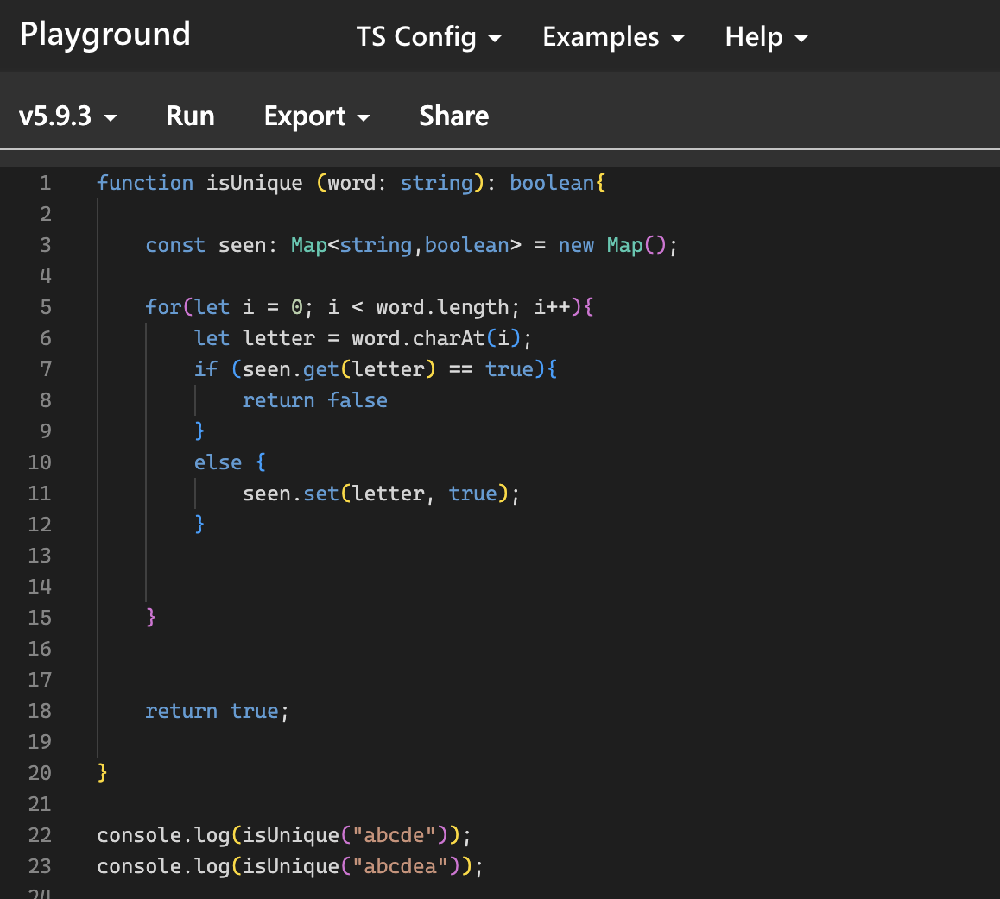

<figure>
  
  <figurecaption> An example of TypeScript code for a 'WOD' </figurecaption>
</figure>

 

## My Beginning with TypeScript

Is TypeScript hard to use? Is TypeScript easy to learn? Many people have different questions when starting a new language. So far I have used TypeScript for less than a month now and I can say it's a pretty useful language. I first have seen Typescript over the 2025 winter break, when I was practicing angular and had to make different components with TypeScript. Beginning with the basics to JavaScript, the assignments helped prepared me with improving with TypeScript. 

## TypeScript vs JavaScript

Reflecting on the language over the past week: TypeScript has many benefits and downsides. Coming from a JavaScript/Java background, TypeScript was pretty easy to get ahold of. Many people would say TypeScript is JavaScript with classes and types, and I would agree with them. TypeScript fills the holes that JavaScript lacks like Object Oriented Programming and the difference in types where 'Let' and 'Const' is used over the single keyword, 'Var'.

## Practicing TypeScript

In my software engineering 1 class at the University of Manoa, we have had to do introduction courses for JavaScript and ES6 from FreeCodeCamp. Doing those courses definitely gave me more clear picture when it comes to the basics with TypeScript. Especially since for both JavaScript and ES6, they both have similar syntax to TypeScript. 

We also have to do daily assignments with "WOD's" (Workout of the Day). These "WOD's" are either at home or during class time and they are assignments to write algorithms to fulfill a task under a certain amount of time. I find these assignments very helpful because they help me to see how many employers would expect me to be able to write algorithms and build web apps in a short amount of time for interviews or assignments on the job. I have definitely had to redo some "WOD's" in order to sharpen my critical thinking skills to write code faster than I did the assignment the 1st time.

TypeScript is definitely a language that I would like to see more of in the future.

