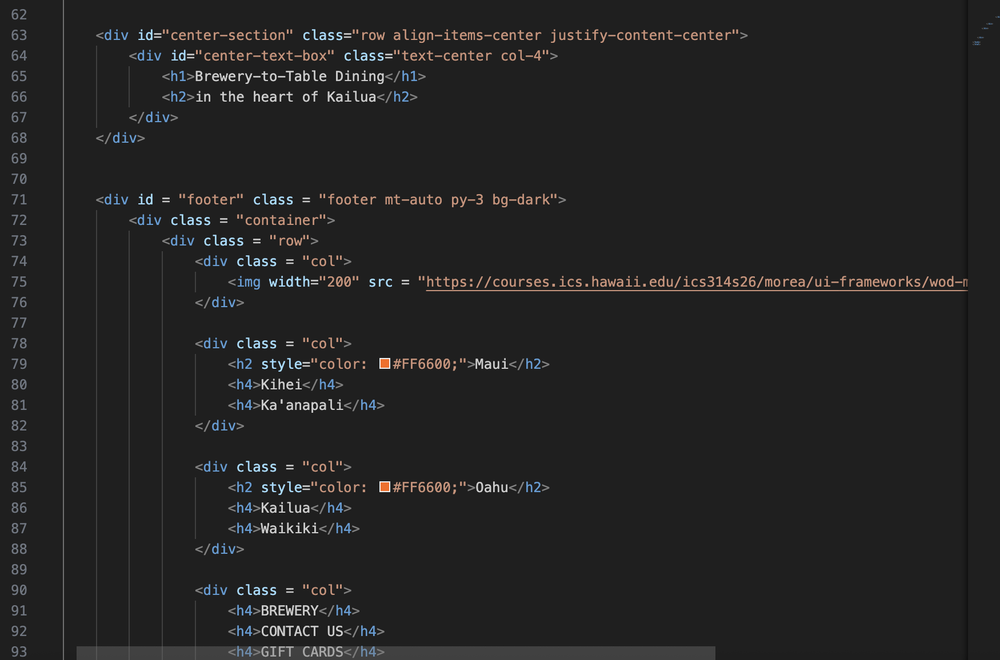

UI Frameworks are an essential kit to any software engineer. Of course many can use raw CSS and HTML to build webpages and websites. But if you want modern and efficient UI, you would use a UI Framework. Over this past week, I have been using Bootstrap 5. Even with a week of experience, I can see there are many benefits and downsides. 

## Benefits

For me, I have been using Bootstrap 5 in my Software Engineering class for many WOD's (Workout of the Day). In fact the pictures above are the code from my most recent WOD in class. With Bootstrap 5 in mind, all I can say is, it's useful, efficent, and looks good. Compared to raw CSS and HTML, I can see that the framework most uses classes through HTML for styling, positioning, and adding special features and icons. For the most part, when using Bootstrap, it lessens the need for an extra CSS stylesheet because all the styling and UI design is done through Bootstrap. And not only is it nice to have all the design mostly in one file, it also looks amazing. 

In the photo above, we recreated a home website for a local company here in Hawaii using straight Bootstrap 5. For my classmates and I, our websites can look almost exactly like the original using Bootstrap. It's amazing to see how much you can do when you truly master a UI Framework

## Downsides

The biggest issue that I can see as a beginner, is that there truly is a high skill cap when using a UI Framework. When I was using Bootstrap 5, something that my classmates and I noticed, is that it's very difficult and time-tedious to use. When I do WOD's, I have to rely on the instructions, previous knowledge, and outside resources to be able to use Bootstrap correctly. There are so many different add-on's and ways of implementing a certain idea: containers, drop down menus, resizing, and repositioning. 

Not to mention, when faced against time, having to use Bootstrap was a challenge. In my previous WOD's, the biggest challenge was the race against time with Bootstrap because it's all about the little details, the little gaps, margins and fonts, when recreating different websites. Not to mention, using Bootstrap can be difficult when someone who doesn't have that much experience needs specific syntax for a specific job for under a specific time. Overall, UI Frameworks can be very useful but there is a learning curver that every beginner needs to overcome.

## Conclusion
UI Frameworks are efficient and useful, but also difficult and tedious. I truly believe that being able to use a UI Framework and mastering it can make or break someone's career because the ability to build webpages are an important asset to have especially during this time and age. For me, even though I lean more on the lesser experienced, I hope to use and master UI Frameworks.

