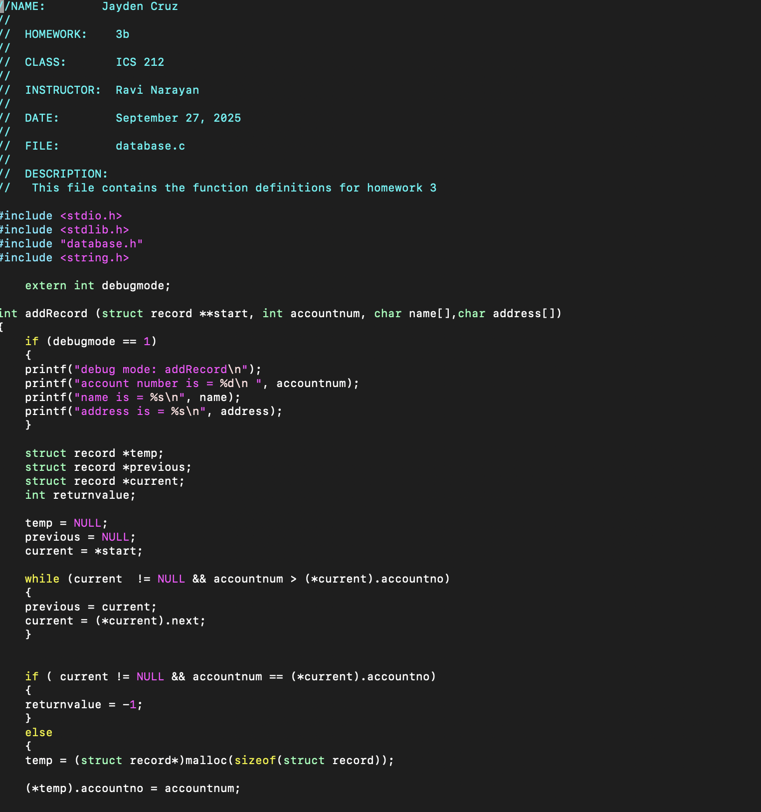
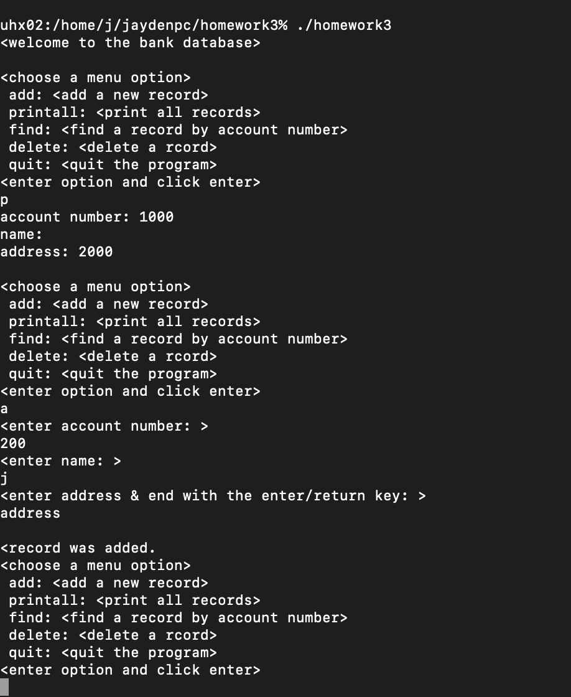

  
  

This Bank Database is a finished project made with C in my Program Structures class at the University of Manoa. I was responsible for the backend functions and the frontend user interface. The goal of the project was to create a record system for a bank so that it could hold information like a
person's address, name, and a person's ID. This project is fully functional with a interface where the user types out their information can be accessed
and saved in a file whenever the program exits. 

Overall, I learned many things through this experience, I gained more experience with UNIX and UNIX commands, also experience with C, and using different data structures in C. 

