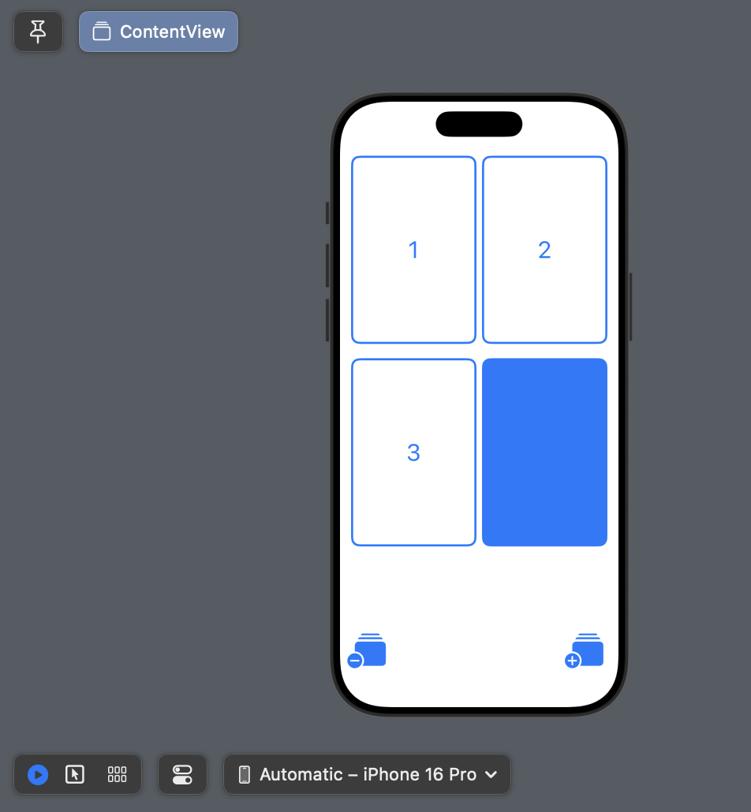

  
  

EasyTask is a beginner project as I continute to hone my skills using Angular/TypeScript. The goal of EasyTask is to provide users with the 
ability to store and access data using different Angular components. This website can be seen as a task checklist for a stored amount of users. Overall, through this project I gained experience in using the Angular CLI, as well as more experience in HTML, CSS, and TypeScript.

You can see the the project at this link: https://github.com/jaydenpc/easyTask

