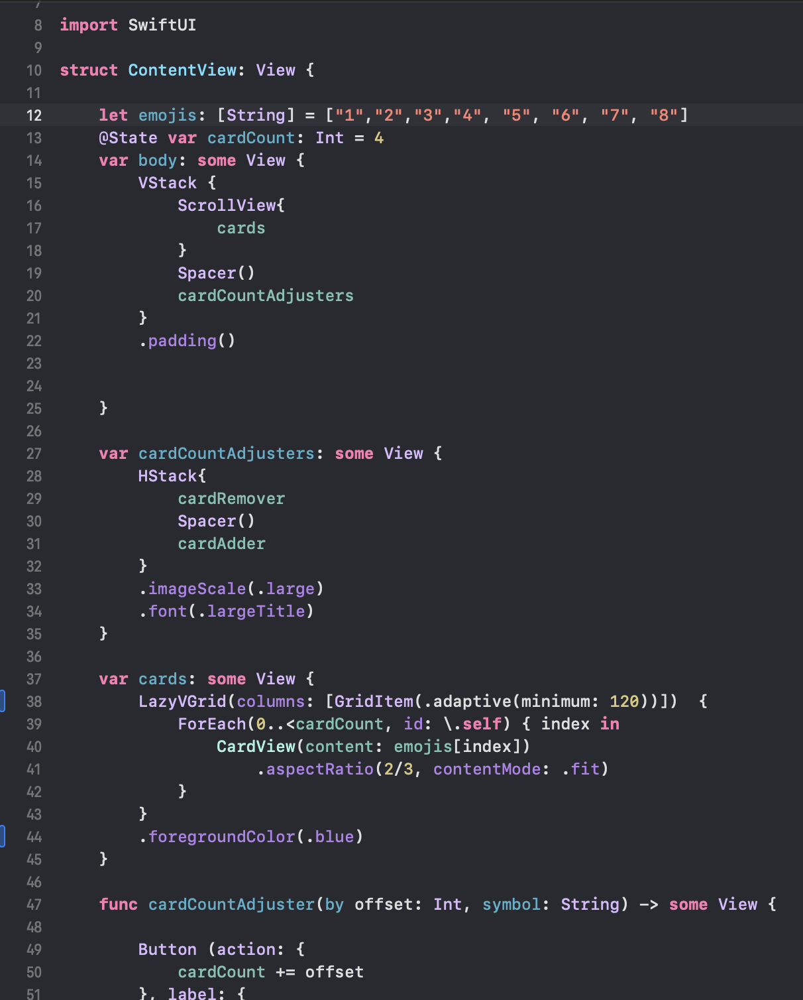
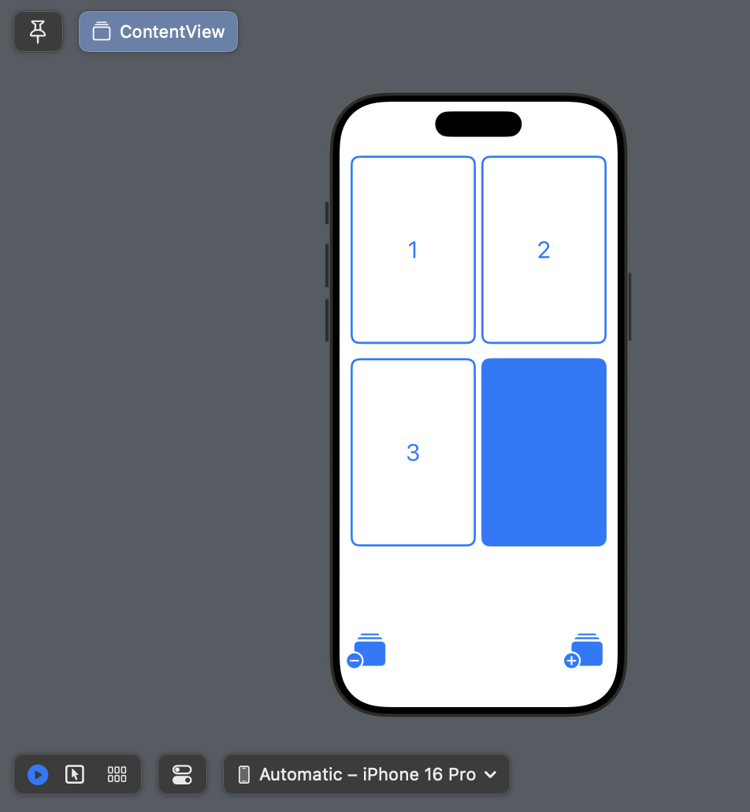

  
  

Memorize is an ongoing mobile app ongoing demo made through Swift on Xcode. The goal of Memorize was to sharpen my skills and practice using the Swift User Interface. The Memorize Demo can change the icon on the cards and add and delete the cards. The cards also can change dynamically based on the user's device.  

<ul>
<li>
<a href="https://student-event-hub.github.io/" target="_blank" rel="noopener">
  Student Event Hub Organization
</a>
</li>
<li>
<a href="https://student-event-hub.vercel.app/" target="_blank" rel="noopener">
  Student Event Hub Application
</a>
</li>

</ul>

