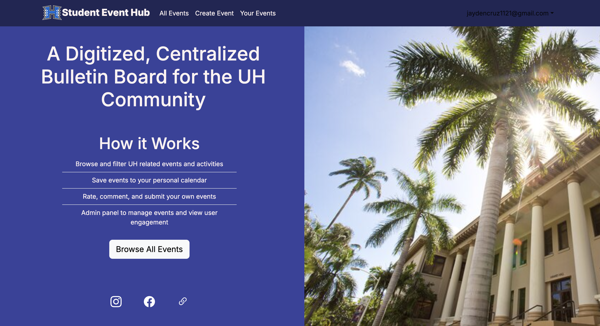
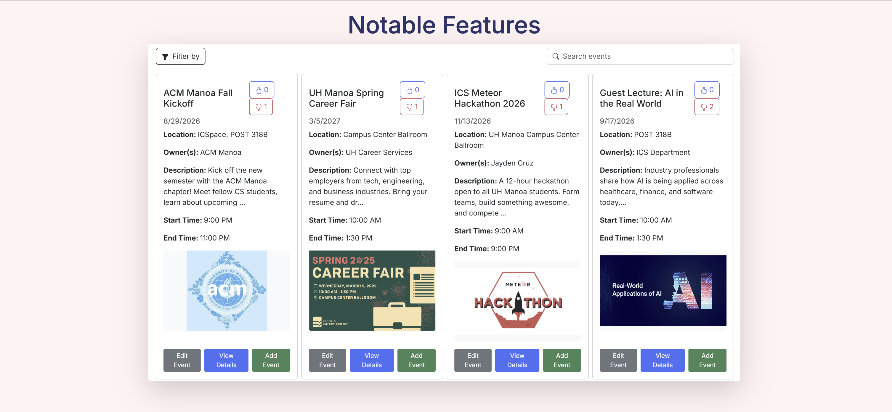
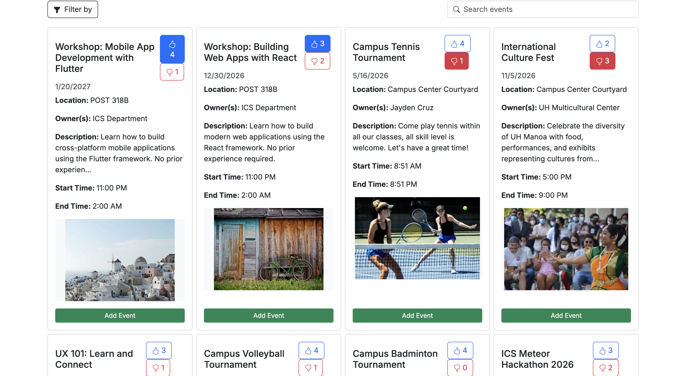
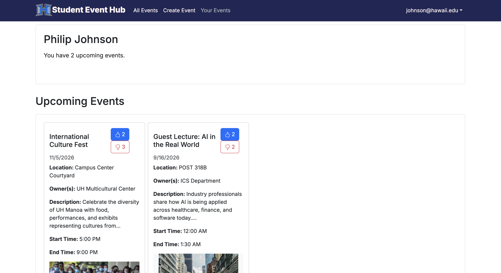

  
  
  
  

Three of my teammates and I created a web application called the Student Event Hub to create a centralized bulletin board for the UH Community to hold, save, and track various student-led events happening on campus. This was part of our ICS 314, Software Engineering final project, where we had about four weeks to implement a fully functioning application.

My teammates and I used a version control platform called Github/Github Organization to plan and visualize our work, where we split our work into different issues that were easy and manageable. Every issue was timed so that we could reflect and see errors early on during the development process. For instance, we had an approximate time on how long we could finish the issue. We also had a timer during our coding efforts, as well as our non-coding efforts, like researching, or looking through documentation. After that, we finalize the issue with our actual time that it took to finish it. Once we were finished with an issue, the implementor would then ask other teammates to ensure everything is satisfied before the implementor merges the code into main and marks the issue as done. This was one of the processes that we had to do to ensure high-quality code and smooth progress towards milestones 1, 2, and 3.

I never had a specifical role of "back-end" or "front-end" but instead I helped to support the group and project through the project organization and accomplishment of different issues we needed to complete before every milestone. Through this application, I gained experience with creating various issues and communciating the scope of each issue so each team member can work their full potential through each task. Also I gained more technical skills with Typescript, Next.JS, Vercel, and Prisma. I have gotten the privilege to work with the 'Create Event Form' and 'All Events Page', and how a user must create an event through the form, and with the data writing to the database, our application having to read the data and display it onto our 'All Events Page'. Overall, this project was a strong experience to work with various team members to produce a finished project.

These links below lead to our Student Event Hub overview and application. The Student Event Hub overview leads to more information regarding our final project. It includes our milestone projects, effort estimate spreadsheet, a user guide, a developer guide, and many more. The Student Event Hub application leads to the actual application of our website, with a fully functional sign in/sign up page, like/dislike button, adding events, and many more.

<ul>
<li>
<a href="https://student-event-hub.github.io/" target="_blank" rel="noopener">
  Student Event Hub Organization
</a>
</li>
<li>
<a href="https://student-event-hub.vercel.app/" target="_blank" rel="noopener">
  Student Event Hub Application
</a>
</li>

</ul>

